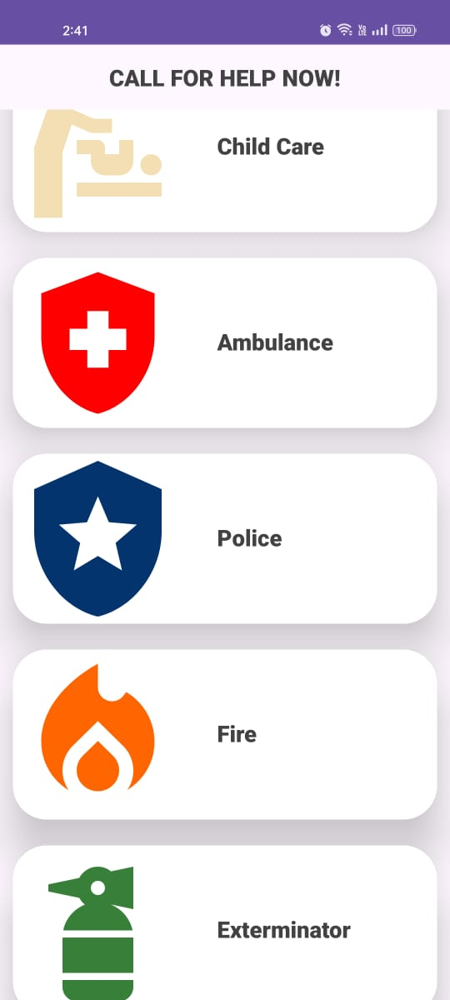
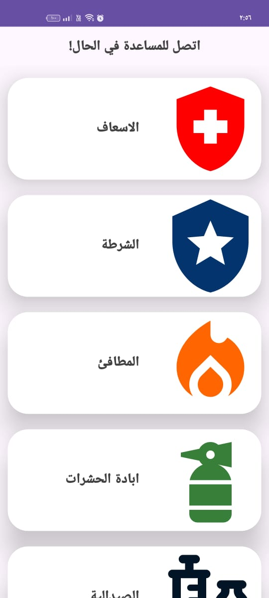
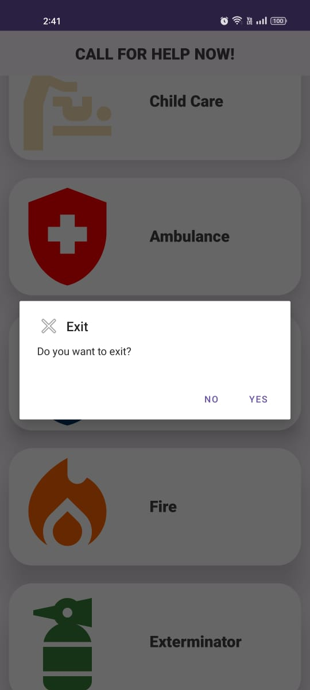
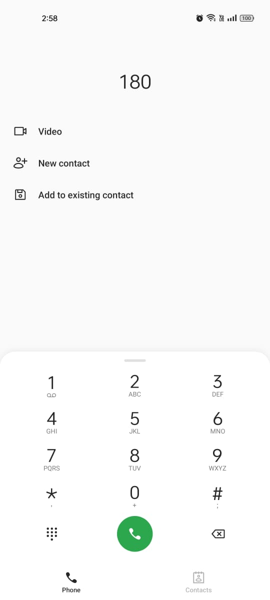

# Emergency App
A simple emergency dialer app built by kotlin and android SDK for android applications 

# This app demonstrates fundamental Android development concepts including:
- User interface creation with XML layouts
- using list item
- recycler viwes
- adapter
- dialog
- intents
- support Arabic language
- Basic Kotlin syntax and control flow

# Key features:
gather all emergency numbers and call them by a click!

# App Snapshots

